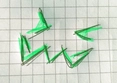

# Just arranging building blocks for the profile .md, ignore

## Resources for profile markdown generation:
- https://gprm.itsvg.in/
- https://readme.so/editor
- https://rahuldkjain.github.io/gh-profile-readme-generator/
- https://shields.io/

# 💻 Tech Stack:
          
# 📊 GitHub Stats:

<br/>
<!-- <br/> -->


<!-- 
## 🏆 GitHub Trophies
 -->

---
[](https://visitcount.itsvg.in)

<!-- Proudly created with GPRM ( https://gprm.itsvg.in ) -->
<table>
  <tr>
    <td style="padding: 0;" valign="middle">
      
    </td>
    <td style="padding: 8px 12px;" valign="middle">
      <strong>Project name</strong><br>
      A short description beside the image.<br>
      Small, compact, and space-efficient.
    </td>
  </tr>
</table>

<table>
  <tr>
    <td valign="middle">
      
    </td>
    <td width="15"></td>
    <td valign="middle">
      <strong>Project name</strong><br>
      🟢 Stable<br>
      ✅ Feature added<br>
      📦 Version 1.2
    </td>
  </tr>
</table>


<!-- Divider --> 
<!--

<!-- Divider -->

| | |
|---|---|
|  | **placeholder title**<br><br>text goes here. |


```diff
+ Added feature
- Removed feature
! Warning message
```

$\color{red}{Red\ text}$
$\color{#00aa00}{Green\ text}$
$\color{blue}{Blue\ text}$

$\color{red}{\textsf{Red}} \color{blue}{\textsf{Blue}} \color{green}{\textsf{Green}}$

$\color{#ff6600}{\textsf{Orange text}}$

$\color{red}{\textsf{Red}}$ $\color{blue}{\textsf{Blue}}$ $\color{#20c997}{\textsf{Teal}}$

$\Large{\color{#58A6FF}{\textsf{Important note}}}$


[](https://github.com/)

<!--
**voidnodeframework/voidnodeframework** is a ✨ _special_ ✨ repository because its `README.md` (this file) appears on your GitHub profile.

Here are some ideas to get you started:

I can add assets within the repo then call them in the readme.md

<svg xmlns="http://www.w3.org/2000/svg" width="420" height="70" role="img" aria-label="Project status: beta">
  <rect width="420" height="70" rx="12" fill="#161b22"/>
  <text x="22" y="44"
        font-family="Arial, sans-serif"
        font-size="28"
        font-weight="bold"
        fill="#58a6ff">
    Project status: Beta
  </text>
</svg>


- 🔭 I’m currently working on ...
- 🌱 I’m currently learning ...
- 👯 I’m looking to collaborate on ...
- 🤔 I’m looking for help with ...
- 💬 Ask me about ...
- 📫 How to reach me: ...
- 😄 Pronouns: ...
- ⚡ Fun fact: ...
-->

<!---------------------------------------------------------------------------->
<br>

<div align = center>

[![Badge License]][License]   
[![Badge Likes]][#]

<br>
<br>

**[![Julia]][JULIA] - Zig - Bash**

<br>
<br>
    
# Buttons
         
**Links  ➞  Buttons**

<br>
<br>

[<kbd> <br> KeyBinding Button <br> </kbd>][KBD]

[![Button Shield]][Shield]

</div>

<br>
<br>


<!---------------------------------------------------------------------------->

[JULIA]: https://github.com/julialang/julia


[Button Shield]: https://img.shields.io/badge/Shield_Buttons-37a779?style=for-the-badge

[License]: LICENSE
[Shield]: Types/Shield.md
[KBD]: Types/KBD.md
[#]: #


<!---------------------------------[ Badges ]---------------------------------->

[Badge License]: https://img.shields.io/badge/-BY_SA_4.0-ae6c18.svg?style=for-the-badge&labelColor=EF9421&logoColor=white&logo=CreativeCommons
[Badge Likes]: https://img.shields.io/github/stars/MarkedDown/Buttons?style=for-the-badge&labelColor=d0ab23&color=b0901e&logoColor=white&logo=Trustpilot


# Links for myself, ignore
[](https://github.com/uazo/cromite)
[](https://github.com/ironfox-oss/IronFox)
[](https://github.com/GrapheneOS/Vanadium)
